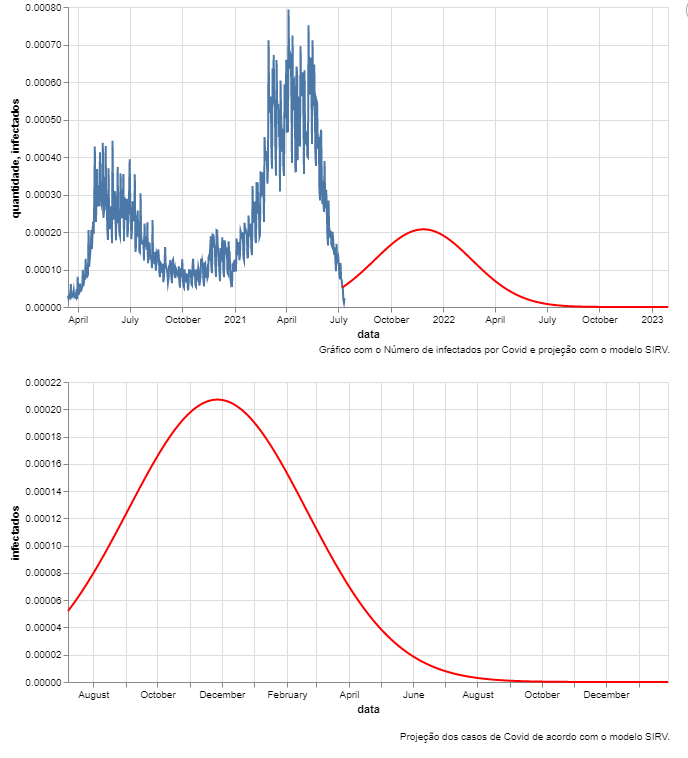
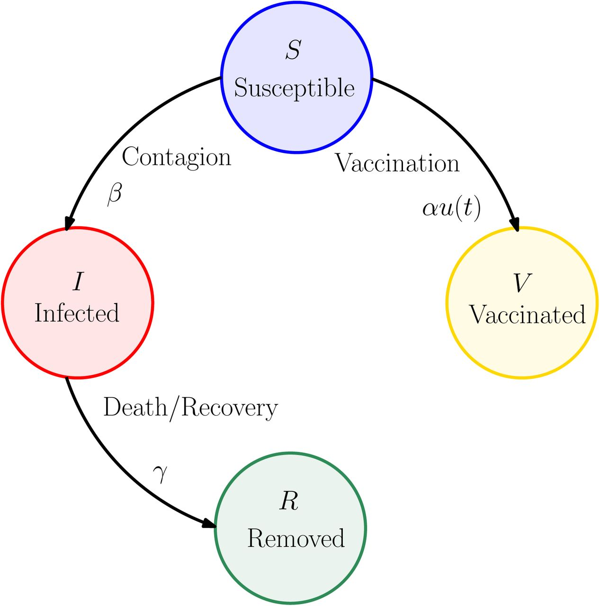

# SIRV model
- We create a SIRV model based on Intissar Harizi, Soulaimane Berkane, and Abdelhamid Tayebi's paper Modeling the Effect of Population-Wide Vaccination on the Evolution of COVID-19 Epidemic in Canada, published on January 15, 2021.

  A docker container with a REST service with five parameters is included in this repository:

  

  - **Vaccine efficacy:** enter a float value between 0.0 and 1 to indicate vaccine efficacy.
  - Vaccine speed: provide a float value between 0.0 and 1 to represent the % of the population that has been vaccinated in a given day.
  - New population of infected people: enter a float number between 0.0 and 1 to represent the % of new people or reinfected cases in the population.
  - Days to add new infected people to the model: an int value containing the number of days to add new diseased people to the model for reinfection or a new population.
  - speed factor: a float number between 0 and 1 that affects the epidemic's speed.

Example of use http://localhost:5100/0.7/0.002/0/10/0/ of the service.

